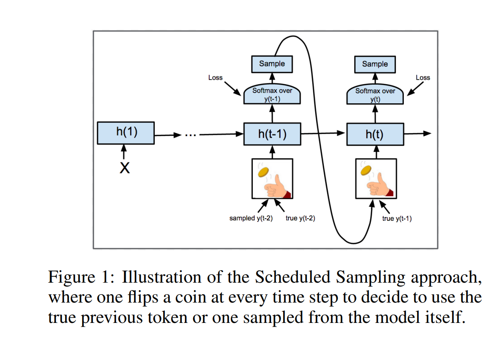
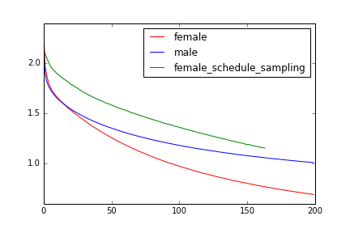
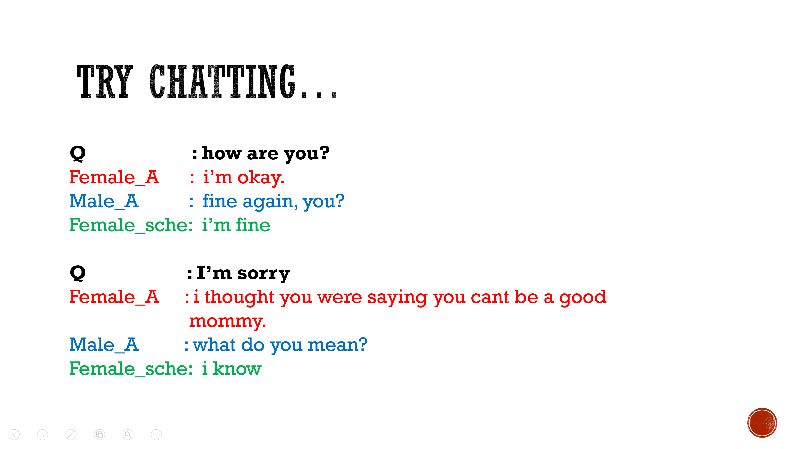
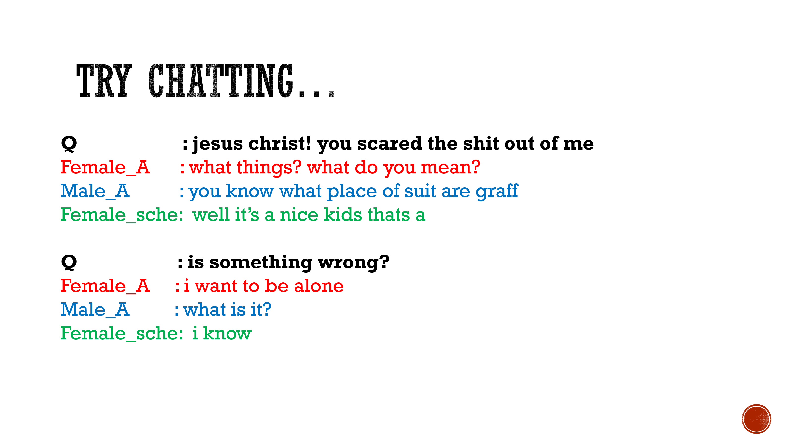

# Schedule Sampling Seq2Seq -- Movie_Script Chatbot -- PyTorch

### Objective
A chatbot which can learn different speaking types between male/female from movie scripts
 
### Dataset
[Cornell movie-dialogue corpus](https://www.cs.cornell.edu/~cristian/Cornell_Movie-Dialogs_Corpus.html)
 - 220,579 conversational exchanges between 10,292 pairs of movie characters 
 - involves 9,035 characters from 617 movies
 
 ### Model
 1. Seq2Seq [[1]](https://papers.nips.cc/paper/5346-sequence-to-sequence-learning-with-neural-networks.pdf)
 
 
 2. Scheduled Sampling for Seq2Seq [[2]](https://arxiv.org/abs/1506.03099)
 
 
 ### Result
 1. Loss
 
  
 2. Chatting...
 
 
 
 ## Reference paper
 - [1] *Sequence to Sequence Learning with Neural Networks*, Ilya Sutskever, Oriol Vinyals, Quoc V. Le, 2014
 - [2] *Scheduled Sampling for Sequence Prediction with Recurrent Neural Networks*, Samy Bengio, Oriol Vinyals, Navdeep Jaitly, Noam Shazeer, 2015
